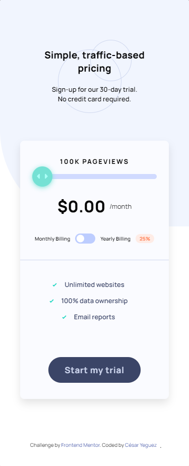
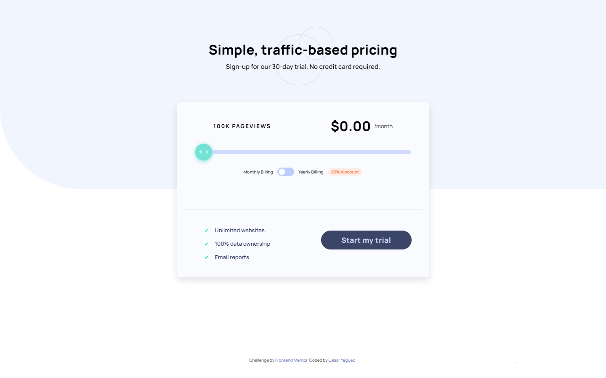

# Frontend Mentor - Interactive pricing component solution

This is a solution to the [Interactive pricing component challenge on Frontend Mentor](https://www.frontendmentor.io/challenges/interactive-pricing-component-t0m8PIyY8). Frontend Mentor challenges help you improve your coding skills by building realistic projects.

## Table of contents

- [Overview](#overview)
  - [The challenge](#the-challenge)
  - [Screenshot](#screenshot)
  - [Links](#links)
- [My process](#my-process)
  - [Built with](#built-with)
  - [What I learned](#what-i-learned)
  - [Author](#author)

## Overview

### The challenge

Users should be able to:

- View the optimal layout for the app depending on their device's screen size
- See hover states for all interactive elements on the page
- Use the slider and toggle to see prices for different page view numbers

### Screenshot

### Links

- Solution URL: [Add solution URL here](https://github.com/cyeguez/Interactive-pricing-component)
- Live Site URL: [Add live site URL here](https://cyeguez.github.io/Interactive-pricing-component/)

## My process

- I configure the project architecture . 🏛️
- I clean the HTML of Comments and styles. 🧹
- I assign the HTML tags. 🎯
- I write the styles, I configure mediaquerys. 🕶️
- I create the logical part in JS. 🧠

### Built with

### What I learned

I learned the use of the range type input, to customize its characteristics.

## Author

- Website - [César Yeguez](https://www.your-site.com)
- Frontend Mentor - [@yourusername](https://www.frontendmentor.io/profile/yourusername)

